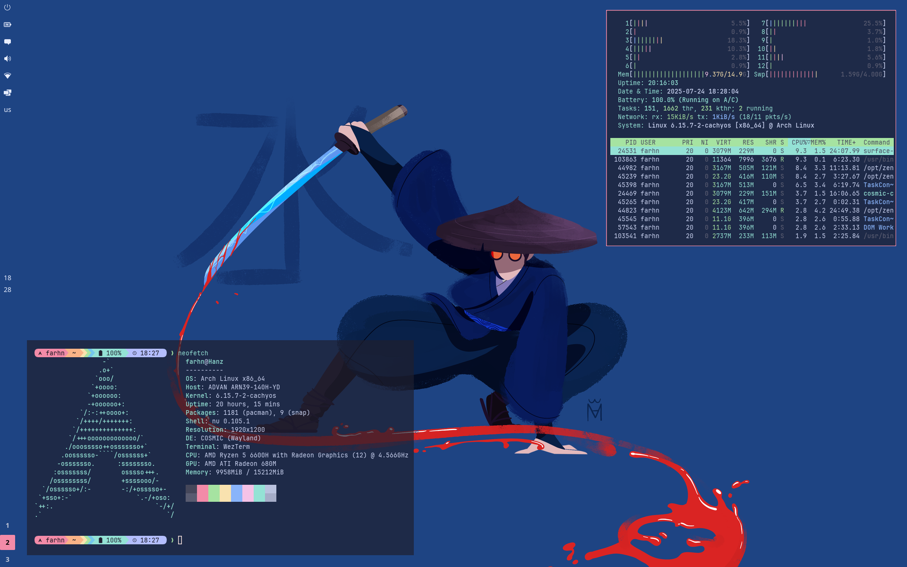

## Welcome to My **`$HOME`**



---
```toml
[desktop]
os = "Arch Linux"
kernel = "CachyOS"
shell = "Nushell"
terminal = "Wezterm"
desktop_environment = "COSMIC"
code_editor = "Neovim"
font = "JetBrains Mono"
language = ["Rust", "Python", "Go", "TypeScript"]
browser = ["Chrome", "Zen"]
color_scheme = "Gruvbox Dark"

[contact]
email = ["farhnkrnapratma@gmail.com", "farhnkrnapratma@protonmail.com"]
matrix = "@farhnkrnapratma:matrix.org"
irc = "farhnkrnapratma"
```
---
I'm a tech enthusiast with interests in:

* 🐧 **Linux & FOSS** – Passionate about exploring Linux distributions and contributing to open-source projects.
* 💻 **Software Engineering** – Builds and improves system-level software.
* 🛡️ **Cyber Security** – Focused on data protection and digital privacy.
---
### My #RoadCard

[](https://roadmap.sh)
---
### Anything else?

Navigate to [**`/etc/profile`**](https://gravatar.com/farhnkrnapratma)
